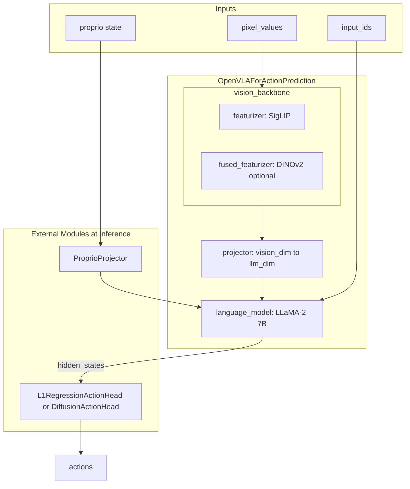

# OpenVLA Architecture and Fine-Tuning

本文档说明 OpenVLA-OFT 的模型架构、Prismatic VLM 权重格式，以及微调方法（LoRA 与可训练模块）。

---

## 1. Prismatic VLM Weights

### 什么是 Prismatic VLM？

**Prismatic VLM** 指 [TRI-ML/prismatic-vlms](https://github.com/TRI-ML/prismatic-vlms) 项目训练的视觉-语言模型。OpenVLA 基于 Prismatic 预训练的视觉-语言能力，在机器人动作数据上进一步微调得到 `OpenVLAForActionPrediction`。

### 原始 Prismatic 权重格式

Prismatic 训练产出的 checkpoint 格式与 HuggingFace 不同，`checkpoints/latest-checkpoint.pt` 内 `model` 包含：

| 键 | 内容 |
|----|------|
| `projector` | 视觉特征投影到 LLM 空间，fc1/fc2/fc3 对应 `projector.0`, `projector.2`, `projector.4` |
| `llm_backbone` | 语言模型（Llama/Mistral 等）权重 |
| `vision_backbone` | TIMM 视觉编码器（SigLIP、DINOv2 等）权重 |

### convert_prismatic_weights_to_hf.py 的作用

[`scripts/extern/convert_prismatic_weights_to_hf.py`](../scripts/extern/convert_prismatic_weights_to_hf.py) 将上述 key 重映射为 HuggingFace 格式，以便 `transformers` 通过 `trust_remote_code=True` 加载：

- `llm.` → `language_model.`
- `projector.0/2/4` → `projector.fc1/fc2/fc3`
- `vision_backbone` → `vision_backbone.featurizer` 或 `vision_backbone.fused_featurizer`

**注意**：OpenVLA 官方 checkpoint（如 `moojink/openvla-7b-oft-finetuned-libero-spatial`）已是 HuggingFace 格式，一般无需运行转换脚本。该脚本主要用于从原始 Prismatic 训练流程产出的权重转换为 HF 格式。

---

## 2. OpenVLA 模型结构

### 结构图

### 核心组件

| 组件 | 类/来源 | 说明 |
|------|----------|------|
| vision_backbone | PrismaticVisionBackbone | SigLIP 主编码器，可选 DINOv2 融合；输出 patch 特征 |
| projector | PrismaticProjector | MLP 将 vision 特征投影到 llm_dim (4096) |
| language_model | AutoModelForCausalLM | LLaMA-2 7B，接受 vision+text+proprio 拼接输入 |
| ProprioProjector | 外部模块 | 2 层 MLP，proprio_dim → llm_dim |
| ActionHead | L1RegressionActionHead / DiffusionActionHead | 从 LLM 最后一层 hidden 预测连续动作 |

### 数据流

1. `pixel_values` → vision_backbone → patch 特征
2. patch 特征 → projector → 投影到 llm_dim
3. 与 text embeddings、proprio embeddings（若启用）拼接 → `language_model` 输入
4. 取 action 位置的 `hidden_states` → action_head → 连续动作 chunk

参考源码：[`prismatic/extern/hf/modeling_prismatic.py`](../prismatic/extern/hf/modeling_prismatic.py)、[`vla-scripts/deploy.py`](../vla-scripts/deploy.py)、[`vla-scripts/finetune.py`](../vla-scripts/finetune.py)。

---

## 3. 微调方法

### 3.1 LoRA 应用范围

- **VLA 主体**：`get_peft_model(vla, LoraConfig)`，`target_modules="all-linear"` —— 对 vision_backbone、projector、language_model 中**所有线性层**施加 LoRA。
- **LoRA 配置**（默认）：`r=32`，`lora_alpha=min(32,16)=16`，`lora_dropout=0`，`init_lora_weights="gaussian"`。
- **冻结策略**：基座权重冻结，仅 LoRA 的 A/B 矩阵可训练。

### 3.2 额外可训练模块（从零训练）

| 模块 | 条件 | 说明 |
|------|------|------|
| ProprioProjector | `use_proprio=True` | 2 层 MLP，proprio → llm_dim |
| L1RegressionActionHead | `use_l1_regression=True` | MLPResNet，hidden → action |
| DiffusionActionHead | `use_diffusion=True` | 噪声预测 + DDIM scheduler |
| NoisyActionProjector | `use_diffusion=True` | 将 noisy action 投影到 llm 空间 |
| FiLMedPrismaticVisionBackbone | `use_film=True` | 在 vision_backbone 上增加 FiLM 层，用于语言条件化 |

### 3.3 训练目标

- **L1 回归**：`torch.nn.L1Loss()(ground_truth_actions, predicted_actions)`
- **Diffusion**：噪声预测 MSE loss

### 3.4 参数统计

`trainable_params` 来自：VLA（LoRA 参数）、action_head、proprio_projector（若启用）、noisy_action_projector（若 diffusion）、vision_backbone 的 FiLM 部分（若 `use_film`）。

### 3.5 Checkpoint 保存内容

- VLA + LoRA adapter（可 merge 为完整权重）
- processor
- proprio_projector、action_head（L1 或 Diffusion）
- noisy_action_projector（若 diffusion）
- vision_backbone（若 FiLM，保存整个 backbone）
- dataset_statistics.json（动作归一化统计）
